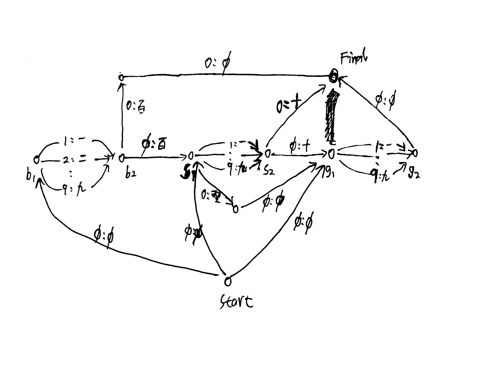

# num_written_to_spoken
Convert numbers from written formate to spoken format in chinese, by building a fst using openfst.

For example:
30504010 => 三千零五十万四千零一十

run it:
```bash
bash written_to_spoken.sh
```

A sketch about a part of the num_written_to_spoken.fst is:


A full fst can be view from `fstdraw` result pdf: num_written_to_spoken.pdf
